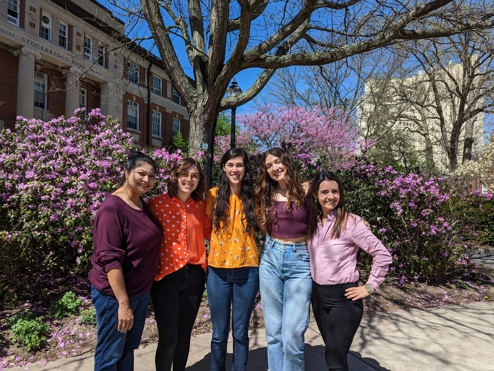
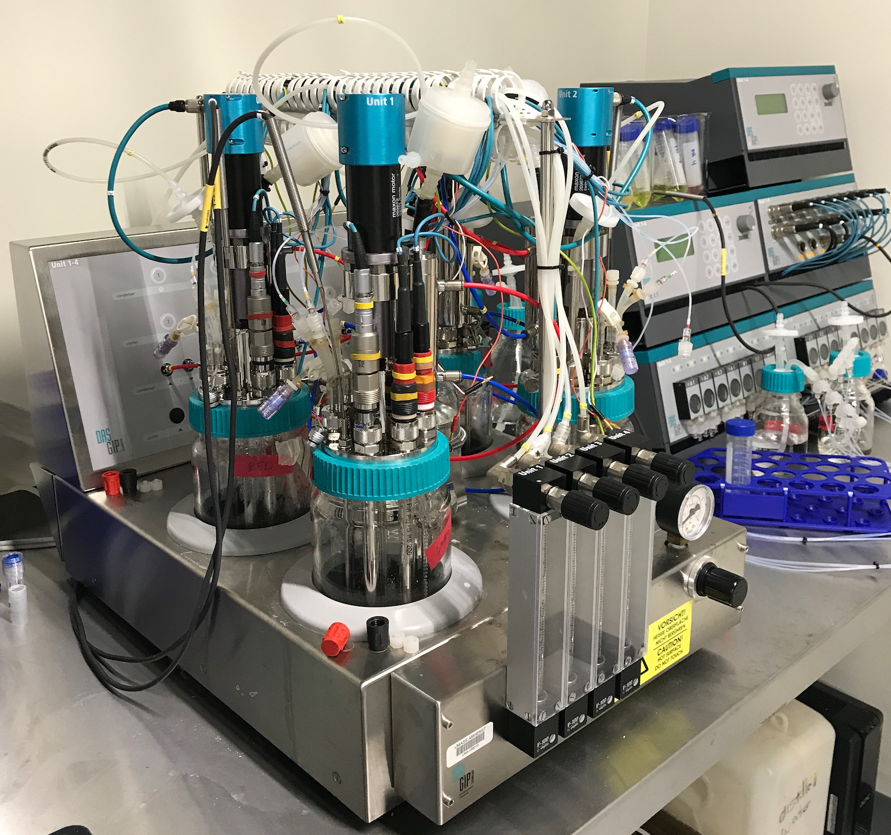
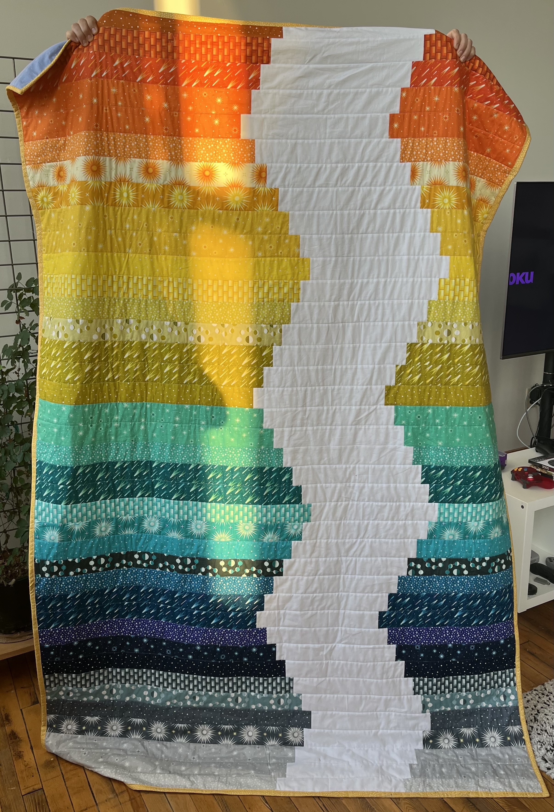

I'm entering my fifth year as a graduate student at the University of Massachusetts Amherst in the [Organismic and Evolutionary Biology program](https://gpls.cns.umass.edu/oeb) working with [Dr. David Sela](https://www.foodsci.umass.edu/faculty/david-sela) in the [Food Science Department](https://www.foodsci.umass.edu/). I study human milk and and the ecology and evolution of the microbes that consume components of it. 

{width=25%}

My current project examines population-level genetic and phenotypic differences in bacterial strains isolated from rural and suburban communities in upstate New York. Often, infants from rural areas have a [greater abundance of beneficial bacteria](https://onlinelibrary.wiley.com/doi/10.1111/all.14877), and we hypothesize this may be one reason why they also have a lower risk of developing allergic diseases. With this information, we hope to provide evidence that certain types of microbiological or nutritional supplementation may alleviate allergic disease outcomes developed in early life.

I use molecular techniques to investigate carbohydrate scavenging in the infant gut commensal *Bifidobacterium longum* subsp. *infantis*. I have experience in bacterial isolation, genotyping PCR, whole genome sequencing, comparative genomics and bioinformatics, as well as absorbance-based microbial growth phenotyping and High Performace Liquid Chromatography (HPLC). I also use a simplified *in vitro* model (shown below) of the distal gut microbiota to study how host-indigestible carbohydrates and supplemented microbes modulate fecal community structure and function.

{width=25%}

In my free time I enjoy bouldering, quilting, watching horror movies or documentaries, reading (mostly fiction), baking, and playing board/card games!

{width=25%}

## About My Funding 

When I started my Ph.D. studies, it wasn't always clear where the money was going to come from. When you're getting a Ph.D. in the natural sciences, you typically work on grant objectives with your principal investigator (or a close collaborator), or assist teaching undergraduate-level courses. I've done a mixure of both -- which is sometimes a requirement in programs. Here's a list of my funding sources: 

>- I'm a proud first-generation student. For my first and last year, I've been generously funded by the Graduate School as a [Spaulding-Smith Fellow](https://www.umass.edu/graduate/inclusion/spaulding-smith-fellows). 
>- One of my previous projects was internally funded by The [Predissertation Research Grant](https://www.umass.edu/graduate/funding/internal-funding) to develop strain-specific qPCR primers in order to investigate competitive interactions among *B. infantis* strains. 
>- I have previously been funded as a Teaching Assistant (TA) in the Biology Department and as a Research Assistant (RA) at the [Genomics Resource Labororatory](https://www.umass.edu/ials/genomics) on campus.
>- Currently I am an RA in the Food Science department working with our collaborators in the [Jarvin-Seppo Lab](https://www.urmc.rochester.edu/pediatrics/jarvinen-seppo-lab.aspx) at the University of Rochester (Rochester, NY).
